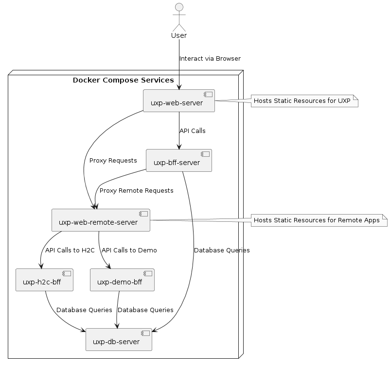

# Unified Experience Platform (UXP)

The **Unified Experience Platform (UXP)** is a work-in-progress project aimed at building a modular and extensible platform to unify multiple applications under a single, cohesive user experience. The framework is designed to act as a reverse proxy, integrating backend applications and rendering their content within the same site using a Shadow DOM for isolation and flexibility.

## Backstory: How UXP Was Born

The idea for the Unified Experience Platform (UXP) emerged from a very personal and practical challenge I faced in my own home. Over the years, I’ve built and deployed various applications running on Raspberry Pi devices and Arduino-compatible microprocessors to manage different aspects of our house. While these applications worked well individually, they operated under different names and interfaces, making it difficult to teach my family where to access them or how to use them. What was second nature to me felt overwhelming and confusing to everyone else.

Initially, I explored existing solutions in the hope of finding a platform that could unify these applications. However, I found that many of them either lacked the flexibility I needed or relied on technologies that felt overly complex or outdated. Some solutions were tied to specific ecosystems, limiting their extensibility, while others required significant effort to adapt to my unique requirements. None of them provided the seamless integration or intuitive user experience I envisioned.

As my needs grew, I realized the importance of creating new applications tailored to specific tasks, such as the H2C project—a digital "talon kirja" required by Finnish law for detached houses. This need for specialized applications highlighted the lack of a unified system for managing and accessing them. At the same time, my home automation setup was beginning to show its age, and introducing newer devices to the mix exposed limitations in the existing UI.

On top of these challenges, I wanted dashboards to provide an easy way to visualize and monitor key metrics, such as temperature, electricity consumption, and even real-time electricity prices. The lack of a single interface for gathering and displaying this data made the setup feel fragmented and disjointed.

From these challenges came the inspiration for UXP: a unified, modular platform that could seamlessly integrate all these applications, new and old, into one cohesive and intuitive user experience. And what is more fun than building your own tailored solution? By leveraging modern technologies like reverse proxy integration, Shadow DOM rendering, and centralized role-based access management, I aim to create a platform that not only simplifies life for my family but also serves as a powerful tool for anyone managing multiple applications in their own environment.

## Vision (Work in Progress)

The Unified Experience Platform (UXP) aims to address the challenges of managing and unifying multiple applications into a single, cohesive experience. The platform is designed with flexibility, extensibility, and modularity in mind, enabling seamless integration of diverse applications and devices.

### Key Objectives

- **Reverse Proxy Integration**: Fetch and render remote applications with resource URL rewriting for seamless embedding into the platform.
- **Shadow DOM Rendering**: Provide style and functionality isolation for embedded applications, ensuring compatibility and a polished user experience.
- **Centralized Role Management**: Define and control access to routes and content based on user groups, offering a secure and tailored experience for each user.
- **Flexible Page Composition**: Mix and order external apps, internal components, and dashboards on a single page for a unified view.-
- **Modular Device Registration**: Enable easy integration and management of modern devices, such as temperature sensors, electricity monitors, and home automation systems.

- **Support for Specialized Remote Apps:**
    - **H2C**: A digital "talon kirja" for managing house-related data, inspired by legal requirements in Finland.
    - **Home Automation Migration**: Revamp the existing UI for managing a Danish LK IHC system while introducing support for newer devices.
    - **Centralized Music System Control**: Build a unified interface for managing multi-room audio systems.
    - **Energy Monitoring**: Create dashboards and applications for tracking electricity consumption and prices, providing real-time data and insights.
    - **Temperature Monitoring**: Support various temperature devices for tracking and visualizing climate data throughout the house.

### Additional Considerations

While the current focus is on addressing my family’s needs, such as simplifying the home UI and managing various devices and systems, the platform has the potential for broader use cases. For example:

- **Localization Support**: While not necessary for our family, as we prefer an English UI, localization could be added later if the platform grows into something with wider adoption.
- **Extensibility for New Apps and Devices**: The modular approach ensures that future applications or devices can be easily added without significant rework.

### Note

This project is in its early stages and is still far from implementing all of the envisioned features. Contributions, ideas, and feedback are welcome as the project evolves!

## Internal Architecture Documentation

UXP includes a set of **internal architectural documents** that describe
how the platform works at a conceptual and runtime level.

These documents capture design intent, trade-offs, and non-obvious behavior
such as Shadow DOM integration, resource proxying, WebSocket handling,
styling isolation, and remote app lifecycles.

This is **not API documentation**.
Field-level behavior is documented in code via JSDoc.

👉 **Read the internal documentation index:**  
(https://github.com/fisaks/uxp/blob/main/docs/uxp/index.md)


## Project Structure

The project is organized as a **TypeScript** monorepo with the following packages:

- **`demo-bff`**: Backend for the demo remote application.
- **`demo-ui`**: Frontend UI for the demo remote application.
- **`h2c-bff`**: Backend for the H2C (House to Care) remote application.
- **`h2c-common`**: Shared utilities for the H2C app UI and BFF.
- **`h2c-ui`**: Frontend UI for the H2C remote application.
- **`tools`**: Miscellaneous tools and utilities.
- **`uxp-bff`**: Backend for frontend services for the UXP.
- **`uxp-bff-common`**: Shared utilities for UXP remote applications.
- **`uxp-common`**: Shared utilities and types shared across UXP UI, BFF, and remote applications.
- **`uxp-ui`**: Frontend for the UXP.
- **`uxp-ui-lib`**: Shared UI components for the UXP and its remote applications.



## Setup

1. Copy the `.env.template` file to create `.env.dev` and `.env.prod` files:

    ```sh
    cp .env.template .env.dev
    cp .env.template .env.prod

    ```

2. Update the environment variables in `.env.dev` and `.env.prod` as needed:

    - For development, set `DATABASE_HOST` to `localhost`.
    - For production, set `DATABASE_HOST` to match the Docker Compose host name for the MySQL image.

## Development environment

To start the development environment, run:

> Starts the development server in a tmux session with multiple windows for different services

```sh
devserver.sh`
```

### Stop

Press `Ctrl-b + d` to detach the session, then run the following command to stop the development server:

```sh
devserver.sh stop
```

## Create Production build

To create a production build, run:

```
./compose.sh build
```

## Start and Stop Production Build

```
./compose.sh up
./compose.sh down

```

## Additional Information

- Ensure you have Docker and Docker Compose installed on your machine.
- Use pnpm for package management. Install it globally if you haven't already:
    ```sh
    npm install -g pnpm
    ```

## Troubleshooting

If you encounter any issues, check the logs for more information:

- Ensure all environment variables are correctly set in the .env files.
- Check the Docker Compose logs:
    ```sh
    docker compose logs
    ```
- Run the following scripts to check logs for specific services:
    ```sh
    ./log.sh <service>
    ```
- Run the following scripts to open a shell in specific services:
    ```sh
    ./shell.sh <service>
    ```
- Run the following scripts to access the database:
    ```sh
    ./mysql.sh
    ```

## Navigating the tmux Environment

- **Detach the tmux Session:** Press `Ctrl+b` and then `d` to detach the session while leaving the processes running.
- **Switch Between Panes:** Use `Ctrl+b` followed by an `arrow key` to switch between panes.
- **Toggle Pane Size:** To make the current pane the whole window, press `Ctrl+b` and then `z`. To toggle back, press `Ctrl+b` and then `z` again.
- **Reattach to the tmux Session:** Run `tmux attach-session -t uxp-dev` or just `devserver.sh`.
- **Kill the tmux Session:** Exit all panes or kill the session with `tmux kill-session -t uxp-dev` or just `devserver.sh stop`.

`tmux kill-session -t uxp-dev` or just `devserver.sh stop`

`tmux kill-server` Will kill the whole tmux server
